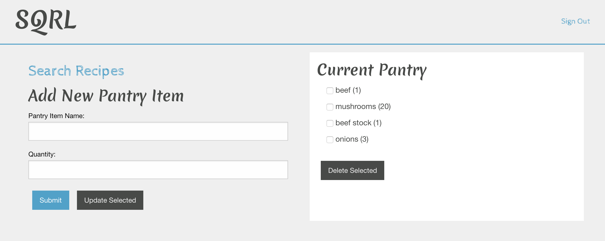

# SQRL

https://app.codeship.com/projects/46bf90a0-707e-0138-fb9d-16f1b1567469/status?branch=master

This app allows signed-in users to track items that exist in their pantry, and to search for recipes that use those ingredients.  If the user finds a recipe they want to make but they are missing an ingredient, they can click that ingredient to see a list of alternatives.

## Usage
Visit https://sqrl-pantry.herokuapp.com/

-or-

Start the Rails server from the root folder.
```
$ rails s
```
Then navigate to http://localhost:3000 in your browser.



## TODO
* Option to filter recipe search with pantry item checkboxes
* Add pantry sections to sort by item type
* User ability to add ingredient alternatives
* Update pantry automatically when recipe is made
